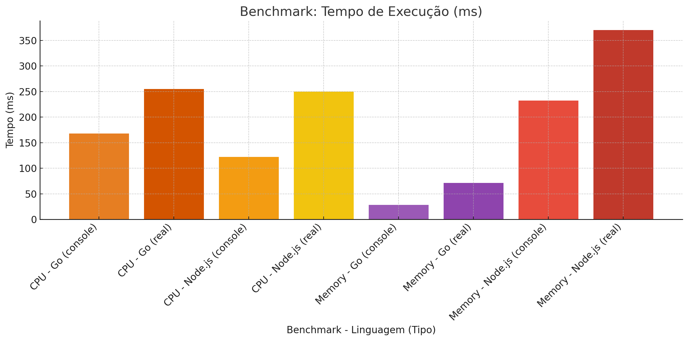

# 🧪 Benchmark: Go vs Node.js

Este projeto compara o desempenho entre **Go** e **Node.js** em dois tipos de benchmarks:

- 🧠 **CPU-bound**: Cálculo de números primos até N
- 🧠 **Memory-bound**: Criação e soma de um array com 10 milhões de itens

Os testes avaliam:

- Tempo de execução interno (`console.log` / `fmt.Printf`)
- Tempo real de execução com `time`
- Uso de CPU e memória (via `time`)

---

## 📁 Estrutura do Projeto

```
benchmark-golang-vs-node/
├── go/
│   ├── cpu/cpu_benchmark.go
│   └── memory/memory_benchmark.go
├── node/
│   ├── cpu-benchmark.ts
│   └── memory-benchmark.ts
├── package.json
└── README.md
```

---

## 🚀 Como rodar os benchmarks

### 1. Requisitos

- Node.js ≥ 22
- Go ≥ 1.24.2


---

### 2. Rodar benchmarks individualmente

#### 🟨 Node.js

```bash
# CPU
time node --import tsx node/cpu-benchmark.ts

# Memory
time node --import tsx node/memory-benchmark.ts
````

#### 🟦 Go

```bash
# CPU
time go run go/cpu/cpu_benchmark.go

# Memory
time go run go/memory/memory_benchmark.go
```

---

## 📊 Exemplo de Gráfico

Comparação entre tempos (em ms):



---

## 📈 Resultados Esperados

| Benchmark | Linguagem | Console (ms) | Tempo Real (ms) |
| --------- | --------- | ------------ | --------------- |
| CPU       | Node.js   | 120–126      | 250–278         |
| CPU       | Go        | 168          | 255             |
| Memory    | Node.js   | 232–246      | 370             |
| Memory    | Go        | 28–30        | **71**          |

---

## 🧠 Conclusões

- **Go é mais eficiente em memória**, com menor uso de RAM e CPU.
- **Node.js entrega bom desempenho em CPU**, ficando muito próximo do Go em tempo real.
- Ideal para medir custo/benefício entre performance e produtividade.

---

## ✅ TODO Futuro

- [ ] Coletar uso de memória (`/usr/bin/time -v`)
- [ ] Exportar PNG do gráfico automaticamente
- [ ] Múltiplas execuções com média e desvio padrão
- [ ] Gráfico interativo com D3.js

---

Feito com ☕, 🧠 e amor por benchmarks ❤️
